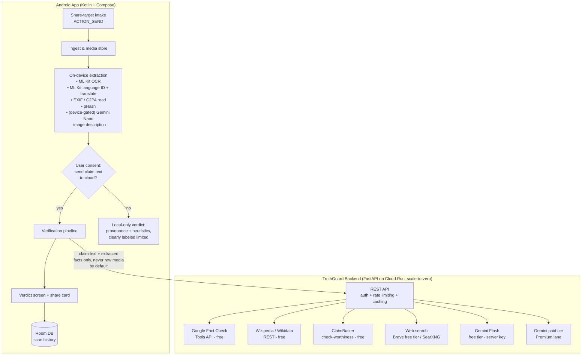
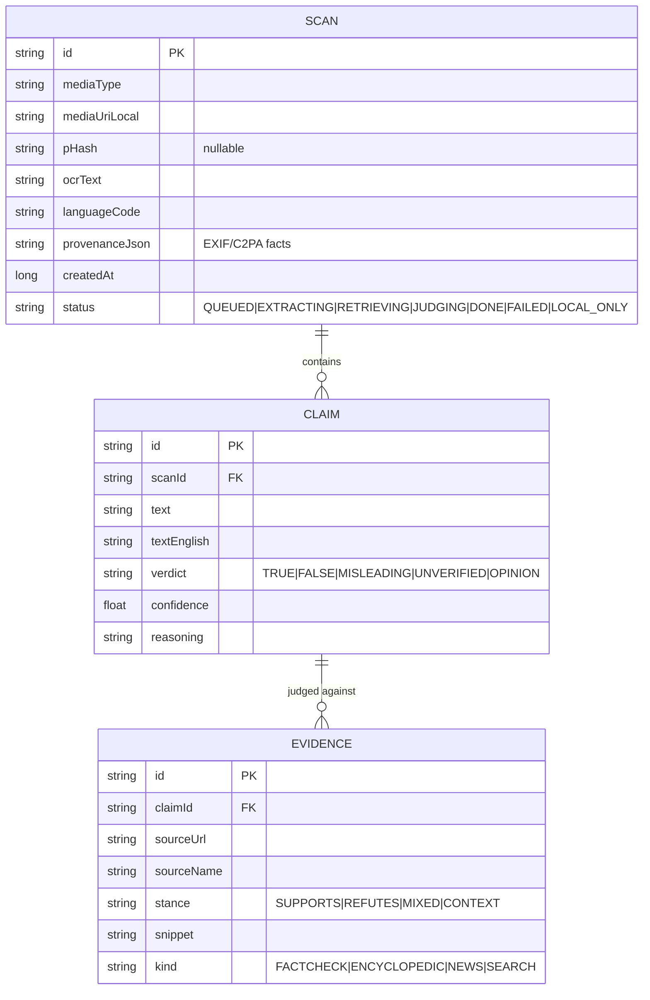

# TruthGuard — Architecture

**Goal**: An Android app that lets anyone who receives a suspicious WhatsApp forward (text, image, video, audio) check it against verifiable sources and get an honest, cited verdict — combating "WhatsApp University" misinformation.

**Status**: Adopted 2026-07-23. Phase P0 (skeleton + share target) is built; see [ROADMAP.md](ROADMAP.md) for current phase.

**Foundational decisions** (rationale in [decisions/](decisions/)):
1. **Native Kotlin + Jetpack Compose** — full rebuild; the Expo prototype is archived on the `legacy` branch.
2. **Hybrid inference** — on-device for cheap/private steps, cloud for reasoning & evidence.
3. **Free-tier-first, Premium lane alongside** — free public APIs as the default path; paid APIs (Gemini paid tier, etc.) as a parallel "Premium" quality tier behind the same interfaces.
4. `minSdk 26`; English UI for v1 (the pipeline handles non-English *content* from day one; localized UI is a planned enhancement).

---

## 1. Product Definition (v1 scope)

### The one user journey that matters

> Uncle forwards a video: *"Breaking: RBI announces all ₹500 notes invalid from Monday!"*
> User long-presses in WhatsApp → **Share → TruthGuard** → app opens with the content already loaded → analysis runs → verdict screen: **"❌ No credible source reports this. 3 fact-checkers have debunked similar claims. [sources]"** → user shares the verdict card back into the chat.

Everything in v1 exists to serve this loop. The **share-back step matters as much as the share-in step** — the product's social value is arming users to push back in the group chat, not just privately knowing the truth.

### v1 in scope
- **Share-target intake**: text, URLs, images shared from any app (WhatsApp, Telegram, browser). This is the front door — it ships in the first phase, not the last.
- **Text claim verification**: claim extraction → evidence retrieval → cited verdict.
- **Image verification**: on-device OCR (text in screenshots/memes is the #1 misinfo vector), image description, then the same claim pipeline. Basic provenance signals (EXIF, C2PA if present).
- **Verdict sharing**: a clean, shareable verdict card (image + text) designed to be dropped back into the group chat.
- **History**: local, private scan history.
- **Free/Premium tiers**: same pipeline, different evidence/reasoning providers.

### Explicitly deferred (v1.x / v2)
- **Video & audio analysis** (frame sampling + transcript pipeline) — deferred because it multiplies complexity ~3× while most WhatsApp misinfo is reachable via text + images; the architecture reserves a clean seam for it.
- Deepfake/manipulation *detection* models (beyond metadata/provenance signals) — the research-grade stuff from the original PDF (AASIST, dual-stream forensics). Honest signal beats fake sophistication.
- Multi-language UI (but the pipeline handles non-English *content* from day one via language ID + translation — essential for the target audience).
- Accounts/sync — everything stays on-device; no login in v1.

---

## 2. What We Keep vs. Discard From the Current Repo

| Keep | Why |
|---|---|
| The product concept & 4-screen information architecture (Home / Verdict / Inspector / Vault) | The UX skeleton is sound; we rebuild it in Compose. |
| The `/evidence/search` backend idea (server-side multi-source proxy) | Right pattern: keys stay server-side, CORS/rate limits solved centrally. Rewritten, not copied. |
| The evidence-source list (Wikipedia, Wikidata, Google Fact Check Tools) | Correct sources; wire them properly this time. |
| The design PDF's *principles* (grounding gate before verdicts, honest uncertainty) | Good north star; we implement pragmatically. |
| The trust-score + evidence + explanation verdict model | Right shape for the domain. |

| Discard | Why |
|---|---|
| The entire Expo/React Native codebase | Rebuilding natively per the project's engineering standards; the salvageable part (UI) must be rewritten in Compose anyway, and the logic layer is ~50% dead code + hardcoded demo fixtures. |
| All 6 hardcoded demo scenarios & the 9-file fixture-matching layer | The core credibility problem. Nothing fabricated survives into v2 — no fake telemetry, no `Math.random()` progress, no static certificate hashes. |
| The mock "on-device model runtime" (`modelRuntimeManager`, `nativeInferenceBridge`, workers) | Replaced by real ML Kit / LiteRT / MediaPipe on-device inference. |
| The agents/reasoners/engines taxonomy (agents ×6, reasoners ×6, 37 services) | Over-decomposed simulation scaffolding. v2 has ~6 pipeline stages with one implementation each. |
| Current `app.py` | Rewritten as a small, tested FastAPI v2 (see §7). The existing one has crash bugs and demo heuristics baked in. |
| The full on-device JNI/whisper.cpp/AASIST architecture from the PDF | Deferred, not rejected — v1 hybrid ships months earlier; the `EvidenceProvider`/`Analyzer` seams let on-device capability grow later without re-architecture. |

---

## 3. System Overview



**Key privacy stance**: raw media never leaves the device by default. On-device extraction turns media into *text* (OCR output, image description, metadata facts); only that text goes to the cloud, and only with a clear, once-per-install consent (re-surfaced contextually). Premium users can *opt in* to sending the image itself for cloud vision analysis.

---

## 4. Android App Architecture

### 4.1 Gradle module structure

Single-app multi-module from day one — cheap to set up now, painful to retrofit:

```
truthguard/
├── app/                          # Compose UI, navigation, DI wiring
├── core/
│   ├── designsystem/             # Theme, Material 3 components, verdict card composables
│   ├── common/                   # Result types, dispatchers, logging
│   └── testing/                  # Shared test fixtures/fakes
├── domain/                       # Pure Kotlin. Use cases, models, repository interfaces. Zero Android deps.
├── data/
│   ├── verification/             # Pipeline repo impl, backend API client (Retrofit/OkHttp)
│   ├── extraction/               # ML Kit OCR/langID/translate, EXIF/C2PA, pHash wrappers
│   └── vault/                    # Room DB, DataStore preferences
└── feature/
    ├── intake/                   # Share-target handling, ingest screen
    ├── verdict/                  # Verdict + evidence detail screens
    ├── inspector/                # Media provenance detail
    └── vault/                    # History
```

- **`domain` is pure Kotlin** (no Android imports) — trivially unit-testable, enforces the dependency rule.
- **UI → Presentation → Domain → Data**, dependencies point inward. Separate models per layer: `ClaimDto` (network) ≠ `Claim` (domain) ≠ `ClaimUiState` (UI).

### 4.2 Tech choices (with rationale)

| Concern | Choice | Why / alternative considered |
|---|---|---|
| UI | Jetpack Compose + Material 3 | Standard. Dynamic color, light/dark from day one. |
| Navigation | Navigation Compose | Standard; type-safe routes. |
| DI | Hilt | Standard choice with Compose/ViewModel integration. |
| Async | Coroutines + Flow/StateFlow | Standard. |
| Local DB | Room | Scan history, cached evidence. |
| Preferences | DataStore (Proto for consent/settings) | Never SharedPreferences. |
| Background work | WorkManager | Long analyses survive process death; share-intent kicks off a Worker so the user can leave and get a notification. |
| Networking | Retrofit + OkHttp + Kotlinx Serialization | Timeouts, retry-with-backoff on idempotent GETs only, offline detection. |
| OCR | **ML Kit Text Recognition v2** | Free, on-device, all devices, excellent Latin + Devanagari/Tamil/etc. script support — critical for Indian-language forwards. |
| Language ID / translation | ML Kit Language ID + on-device Translate | Free, on-device; lets the pipeline normalize claims to English for evidence search while preserving the original. |
| Image description | ML Kit GenAI Image Description (Gemini Nano) **where device supports it**; graceful fallback to cloud (with consent) or skip | On-device, free, but gated to AICore devices (Pixel 8+/10, S24+ etc.). Capability-detect at runtime — honestly, not hardcoded `true`. |
| Provenance | `metadata-extractor` (EXIF) + C2PA Kotlin/Rust bindings (CAI open source) | Real parsing this time; "no provenance data" is a normal, honest result, not a red flag. |
| Near-duplicate detection | Perceptual hash (pHash/dHash, pure Kotlin) stored in Room | Free "you already checked a variant of this image" signal; foundation for a future shared-hash lookup. |
| Crash/analytics | None in v1 (privacy posture); structured local logging with zero PII | Revisit before public release with an opt-in. |

### 4.3 Share-target: the front door

`AndroidManifest.xml` intent filters on a dedicated `ShareActivity`:
- `ACTION_SEND` / `ACTION_SEND_MULTIPLE` for `text/plain` and `image/*` (v1), `video/*`, `audio/*` (declared later when supported — never declare what we can't handle).
- `ShareActivity` is a thin trampoline: persist the shared content to app-private storage (WhatsApp URIs are transient permissions), enqueue an `AnalysisWorker`, route into the main task's ingest screen.
- Also register as a **process-text** target (`ACTION_PROCESS_TEXT`) so selected text anywhere can be checked without leaving the app the user is in.

No runtime permissions needed for the core flow (shared content arrives via URI grants). Camera permission only if/when the user taps the in-app camera capture — requested contextually with an explanation of why it is needed.

---

## 5. The Verification Pipeline

Six stages, one implementation each, every stage producing typed results with explicit confidence and provenance ("where did this number come from"):

```mermaid
sequenceDiagram
    participant W as AnalysisWorker
    participant EX as 1. Extract
    participant CL as 2. Claim detection
    participant EV as 3. Evidence retrieval
    participant JG as 4. Judgment
    participant GD as 5. Grounding gate
    participant RP as 6. Report

    W->>EX: shared content
    Note over EX: On-device: OCR, lang ID/translate,<br/>EXIF/C2PA, pHash, image description
    EX->>CL: normalized text + facts
    Note over CL: Split into atomic claims,<br/>score check-worthiness<br/>(ClaimBuster or LLM), pick top N
    CL->>EV: claims (with user consent)
    Note over EV: Parallel: Fact Check API,<br/>Wikipedia/Wikidata, web search.<br/>Tiered free → premium.
    EV->>JG: claims + evidence set
    Note over JG: LLM (Gemini Flash) judges each claim<br/>ONLY against retrieved evidence,<br/>structured JSON out: verdict, confidence,<br/>per-source stance, reasoning
    JG->>GD: draft verdict
    Note over GD: Gate: every citation must exist in the<br/>evidence set (no hallucinated sources);<br/>low evidence ⇒ verdict capped at<br/>"UNVERIFIED", never "FALSE"
    GD->>RP: final verdict
    Note over RP: Verdict card + evidence list +<br/>honest limitations text
```

### Design rules that fix the v1 credibility problem
1. **No fabricated output, ever.** Every number on screen traces to a computation. Anything not computed doesn't render.
2. **Evidence-grounded judgment only**: the LLM is prompted with the retrieved evidence and *forbidden* from using parametric memory as a source; the grounding gate rejects any cited URL not in the retrieval set. This is the pragmatic version of the PDF's Check-Grounding-API gate.
3. **Verdict vocabulary is honest**: `TRUE / FALSE / MISLEADING / UNVERIFIED / OPINION` — with `UNVERIFIED` designed as a *respectable, common* outcome, not a failure state. Insufficient evidence caps confidence; it never flips to a confident verdict.
4. **Fact-checker hits outrank LLM judgment**: if Google Fact Check returns an IFCN fact-checker's review of this exact claim, that's the headline result, with the LLM used to summarize/match, not overrule.

### Free vs. Premium lanes

Both lanes implement the same two interfaces — `EvidenceProvider` and `JudgmentProvider` — chosen by tier config. Nothing else in the pipeline knows which lane it's on.

| Stage | Free lane | Premium lane |
|---|---|---|
| Check-worthiness | ClaimBuster free API (or skip: treat all claims as check-worthy under a cap of 3) | Gemini Flash paid — better claim splitting |
| Fact-check lookup | **Google Fact Check Tools API** (free; aggregates PolitiFact, Snopes, AFP, BOOM, Alt News, Factly, Vishvas News — the exact ecosystem for WhatsApp-India misinfo) | Same (it's free for everyone) |
| Encyclopedic | Wikipedia + Wikidata REST (free) | Same |
| Web search | Brave Search API free tier (~2k queries/mo) with server-side cache; SearXNG self-hosted on the same Cloud Run service as a fallback | Paid search API (Brave paid / Google Custom Search) — more results, fresher |
| Judgment LLM | **Gemini Flash free tier via server-held key** (~1,500 req/day on Gemini 3 Flash — plenty for a prototype's whole user base) | Gemini Flash/Pro paid — higher limits, bigger context, image input |
| Cloud vision (image sent to cloud) | Not available (on-device description only) | Gemini vision on the image itself, opt-in per scan |

**Quota reality check**: the free lane's binding constraint is Gemini free tier (10 RPM / ~250–1,500 RPD depending on model). At ~2 LLM calls per scan, that's ~100–700 scans/day globally — fine for prototype/beta, and the backend's per-device rate limiting + response caching (identical claims are common for viral forwards — cache hits are the norm, not the exception) stretches it much further. Viral-forward caching is a *feature*: the tenth person to check the same hoax gets an instant answer.

---

## 6. Backend (v2)

Small, boring, rewritten FastAPI service on Cloud Run (scale-to-zero, free tier covers prototype usage):

- **Endpoints**: `POST /v1/verify` (claim text + extracted facts → verdict), `POST /v1/evidence` (claims → evidence set, for on-device-judgment experiments later), `GET /health`.
- **Why a backend at all** (vs. app-direct API calls): API keys can be extracted from any shipped APK — keys live server-side only. Plus: response caching across users, per-device rate limiting, one place to swap providers, and the free-tier quota is a *shared* resource that needs central stewardship.
- **Auth**: per-install anonymous device token (Play Integrity API attestation before issuing tokens — stops trivial scripted abuse of the shared Gemini quota), rate limit per token.
- **Caching**: normalized-claim-hash → verdict cache (Firestore or just SQLite-on-GCS for prototype) with TTL; evidence cache with shorter TTL.
- **No user content stored** beyond the hashed-claim cache; no PII; structured logs with content redacted.
- **Testing**: pytest suite over every endpoint from day one — the current backend's two `NameError` crash bugs existed precisely because zero tests ever exercised the real paths.
- Written in Python/FastAPI (kept — it's the right tool and the Cloud Run deploy pipeline exists) but as a fresh codebase with pinned `requirements.txt`, mypy, and CI.

---

## 7. Data & Storage



- Room for all of the above; media files in app-private storage with a size-capped LRU.
- DataStore (Proto): consent state, tier, settings. Premium entitlement via Play Billing later.
- **No cloud persistence of user scans in v1** — the vault is private and local, full stop. (This is a marketable feature for this audience, not just a shortcut.)

---

## 8. Security & Privacy

- **Threat model headline**: the user's *scan content is sensitive* (what family members send is private), and the app's *verdicts are adversarially interesting* (misinfo peddlers would love it to look wrong). Both drive the same rule: honesty + minimal data movement.
- Raw media on-device by default; consent gate before any text leaves; per-scan opt-in for Premium image upload.
- Server-held API keys; Play Integrity-gated device tokens; per-token rate limits (protects quota and cost).
- HTTPS only, certificate pinning to the backend (OkHttp `CertificatePinner`) — the app talks to exactly one host.
- No secrets in the repo or APK; backend config via Cloud Run env/secret manager.
- Exported components: only `ShareActivity` is exported, with strict intent-type filters and URI-permission validation (guard against intent spoofing / path traversal via malicious `content://` URIs — validate authority, copy via `ContentResolver`, never trust file paths).
- Structured logging with claim text redacted by default; debug builds only may log content.
- Room DB unencrypted in v1 (app-private storage is the OS baseline); SQLCipher considered only if user research says vault secrecy matters more than the complexity.

---

## 9. Testing & CI

Tests land alongside implementation, not after:

| Layer | What | Tools |
|---|---|---|
| `domain` | Every use case; pipeline state machine; grounding-gate rules (the "no hallucinated citations" invariant gets exhaustive tests) | JUnit5, Kotest assertions |
| `data` | Repos with fake API/DB; Room DAO tests; DTO↔domain mappers; extraction wrappers against fixture images (a small corpus of real forward-style memes/screenshots in multiple scripts) | Robolectric where needed, MockWebServer |
| ViewModels | State emission per event | Turbine |
| UI | Verdict rendering per state incl. UNVERIFIED/FAILED/LOCAL_ONLY; share-card golden tests | Compose UI test, Paparazzi screenshots |
| Backend | Every endpoint, provider fallback chains, cache behavior, rate limiting | pytest + httpx |
| E2E | Share-intent → verdict happy path on emulator | Maestro (once share flow exists) |
| Quality gates | ktlint + detekt + Android Lint, zero-warning policy; mypy + ruff on backend | GitHub Actions on every PR |

**Eval harness** (the honest version of the old 5-example `benchmark.js`): a labeled set of ~100 real, resolved claims (drawn from public fact-checker archives) run against the pipeline in CI-on-demand, reporting accuracy/UNVERIFIED-rate/hallucinated-citation-rate. This is how we know the thing actually works — the single discipline whose absence produced the v1 demo-fixture culture.

---

## 10. Delivery Phases

Tracked in [ROADMAP.md](ROADMAP.md). Each phase lands as reviewable, single-responsibility commits with tests, and each ends with something demonstrable on a real device.

---

## 11. Top Risks & Mitigations

1. **LLM judgment quality** — the verdict is only as good as retrieval + prompting. *Mitigation*: fact-checker hits outrank LLM; grounding gate; UNVERIFIED-by-default posture; eval harness in CI from P1.
2. **Free-tier quota exhaustion** — shared Gemini/Brave quotas are finite. *Mitigation*: aggressive claim-hash caching (viral forwards are exactly the high-cache-hit case), per-device rate limits, graceful "quota busy, queued" UX, Premium lane as the pressure valve.
3. **Adversarial/abusive use** — people will try to get the app to bless falsehoods or drain quota. *Mitigation*: Play Integrity gating, server-side rate limits, no user-supplied prompts reaching the LLM (claims are extracted, then wrapped in a fixed prompt).
4. **Play Store policy** — fact-checking apps face review scrutiny. *Mitigation*: every verdict cites sources; app never claims certainty it doesn't have; clear "not a substitute for professional advice" framing on medical/financial claims.
5. **Scope creep back toward the PDF** — the fully-on-device vision is seductive. *Mitigation*: the interfaces (`EvidenceProvider`, `JudgmentProvider`, `Analyzer`) are the sanctioned extension points; anything else needs a plan revision, not ad-hoc additions.

